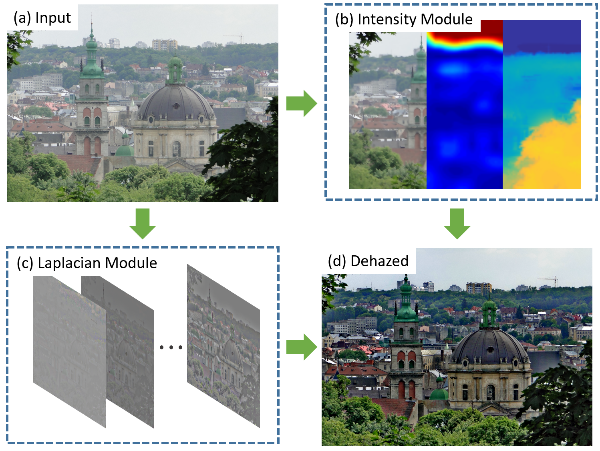
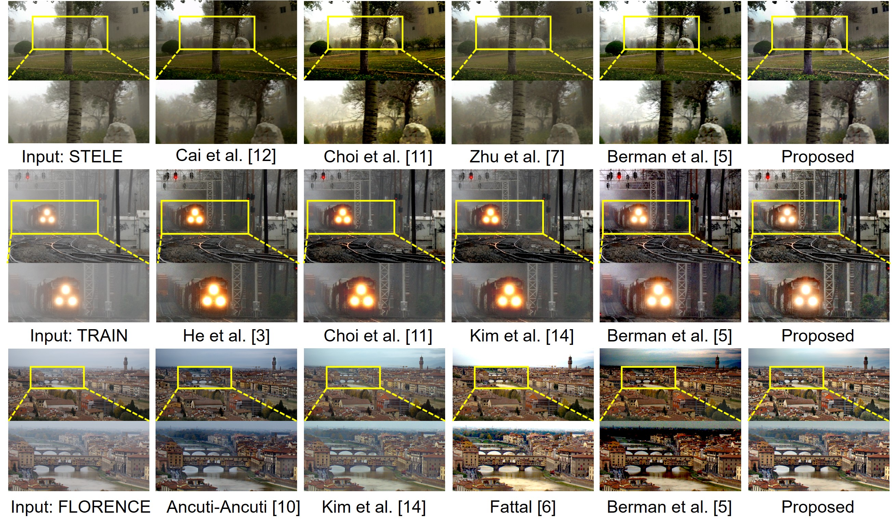

# Multi-band-enhancement (Dehaznig)

<p align="center">
  
</p>

This is the repository for the paper 'Model Assisted Multi-band Fusion for Single Image Enhancement and Applications to Robot Vision'.
The detail of the method is described in the paper:

[Model Assisted Multi-band Fusion for Single Image Enhancement and Applications to Robot Vision](http://irap.kaist.ac.kr/index.php/Main/Publication?action=bibentry&bibfile=ref.bib&bibref=ycho-2018-ral)

If you want to use this code, please cite our publication below.

```
@ARTICLE { ycho-2018-ral,
    AUTHOR = { Younggun Cho and Jinyong Jeong and Ayoung Kim },
    TITLE = { Model Assisted Multi-band Fusion for Single Image Enhancement and Applications to Robot Vision },
    JOURNAL = { IEEE Robotics and Automation Letters },
    YEAR = { 2018 },
    NOTE = { Accepted. To appear. },
}
```

## Usage

<p align="center">
  
</p>

### Requirements
- MATLAB (tested on 2015 or above)

### Demo

Run 'demo.m' script to get sample results. There are several sample haze images in _images/fattal_ folder. Once the process is done, the output image and transmission map will be plotted.

## Author

Younggun Cho (yg.cho@kaist.ac.kr)

## License

The software code of the algorithm is provided for non-commercial use under the attached LICENSE.md
